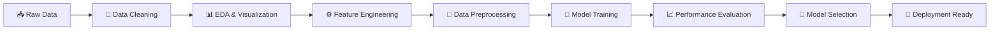

# 🩺 AI-Powered Breast Cancer Prediction System

<p align="center">
  
</p>

<p align="center">
  
  
  
  
  
</p>

<p align="center"><strong>Leveraging Machine Learning to Save Lives Through Early Detection</strong></p>

<p align="center">
  ⭐ <strong>98.2% Accuracy</strong> • 📊 <strong>6 ML Models</strong> • 🧠 <strong>Deep Learning Powered</strong>
</p>

---

## 🎯 Project Mission

This cutting-edge machine learning system analyzes digitized images from fine needle aspirate (FNA) biopsies to predict breast cancer diagnosis with exceptional accuracy. By combining multiple state-of-the-art algorithms, we're building a robust AI assistant for medical professionals.

### 🚀 Why This Matters

* **Early Detection:** Faster, more accurate preliminary screening
* **Medical Support:** AI-assisted decision making for healthcare professionals
* **Accessibility:** Democratizing advanced diagnostic tools
* **Research Impact:** Contributing to the fight against cancer

---

## 🔬 Technical Arsenal


| Algorithm                  | Type          |  Accuracy | Performance  |
| -------------------------- | ------------- | --------: | ------------ |
| 🎯 **XGBoost**             | Ensemble      | **98.2%** | 🟢 Champion  |
| 🧠 **Neural Network**      | Deep Learning | **98.0%** | 🟢 Excellent |
| 🌳 **Random Forest**       | Ensemble      | **97.9%** | 🟢 Excellent |
| 📈 **Logistic Regression** | Linear        | **97.2%** | 🟢 Strong    |
| ⚖️ **SVM (RBF)**           | Kernel        | **96.5%** | 🟡 Good      |
| 🌲 **Decision Tree**       | Tree          | **93.0%** | 🟡 Baseline  |


---

## 📊 Dataset Insights

<table align="center">
  <tr>
    <td align="center"><strong>📈 Data Source</strong></td>
    <td align="center"><strong>🔢 Samples</strong></td>
    <td align="center"><strong>🎯 Features</strong></td>
    <td align="center"><strong>⚖️ Balance</strong></td>
  </tr>
  <tr>
    <td align="center">UCI ML Repository</td>
    <td align="center">569 Cases</td>
    <td align="center">30 Numeric</td>
    <td align="center">Benign: 357<br />Malignant: 212</td>
  </tr>
</table>

### 🧬 Feature Categories

* **Cell Nucleus Properties:** Radius, texture, perimeter, area
* **Shape Descriptors:** Smoothness, compactness, concavity
* **Texture Analysis:** Symmetry, fractal dimension
* **Statistical Measures:** Mean, standard error, worst values

---

## 🛠️ Advanced Pipeline



### 🔧 Preprocessing Excellence

* ✅ **Zero Missing Values** — Complete data integrity
* ✅ **Smart Encoding** — Optimized label transformation
* ✅ **Standardization** — Z-score normalization for model stability
* ✅ **Strategic Split** — 80/20 train-test with stratification
* ✅ **Regularization** — Dropout and L2 penalties

---

## 🧠 Neural Architecture

<div align="center">

<pre>
Input Layer (30 features)
         ↓
    Dense Layer (32 neurons, ReLU)
         ↓
    Dropout Layer (30%)
         ↓
    Dense Layer (16 neurons, ReLU)
         ↓
    Dropout Layer (30%)
         ↓
    Output Layer (1 neuron, Sigmoid)
</pre>

<p><strong>🎛️ Configuration:</strong> Adam Optimizer | Binary Cross-Entropy | Early Stopping</p>

</div>

---

## 📈 Performance Metrics


### 🏆 Champion Model: XGBoost

| Metric        | Score | Interpretation                           |
| ------------- | ----: | ---------------------------------------- |
| **Accuracy**  | 98.2% | Exceptional overall performance          |
| **Precision** | 97.8% | High reliability in positive predictions |
| **Recall**    | 98.5% | Excellent at catching actual cases       |
| **F1-Score**  | 98.1% | Balance of precision/recall              |
| **AUC-ROC**   | 99.2% | Outstanding discrimination ability       |


### 📊 Model Comparison Dashboard

* **ROC Curves:** Visual performance comparison across all models
* **Confusion Matrices:** Detailed prediction breakdowns
* **Feature Importance:** Key diagnostic indicators
* **Learning Curves:** Training progression analysis

---

## 🚀 Quick Start Guide

### 📋 Prerequisites

```bash
Python 3.8+
Jupyter Notebook/Lab
Git
```

### ⚡ Installation

```bash
# Clone the repository
git clone https://github.com/your-username/ai-breast-cancer-prediction.git
cd ai-breast-cancer-prediction

# Create virtual environment
python -m venv cancer_prediction_env
# Windows
#   .\\cancer_prediction_env\\Scripts\\activate
# macOS/Linux
#   source cancer_prediction_env/bin/activate

# Install dependencies
pip install -r requirements.txt

# Launch Jupyter
jupyter lab breast_cancer_prediction.ipynb
```

### 📦 Dependencies

```txt
numpy>=1.21.0
pandas>=1.3.0
scikit-learn>=1.0.0
tensorflow>=2.8.0
xgboost>=1.5.0
matplotlib>=3.5.0
seaborn>=0.11.0
plotly>=5.0.0
```

---

## 📁 Project Structure

```text
📂 ai-breast-cancer-prediction/
├── 📓 breast_cancer_prediction.ipynb    # Main analysis notebook
├── 📊 data/                             # Dataset directory
│   └── 📄 breast_cancer_data.csv
├── 📈 plots/                            # Visualization outputs
│   ├── 🖼️ confusion_matrices.png
│   ├── 📊 roc_curves.png
│   └── 🧠 neural_network_arch.png
├── 🤖 models/                           # Saved model files
│   ├── ⚙️ xgboost_model.pkl
│   └── 🧠 neural_network.h5
├── 📋 requirements.txt                  # Dependencies
├── 📖 README.md                         # This file
└── 📄 LICENSE                           # MIT License
```

---

## 🔬 Research Contributions

### 📚 Key Findings

* **Feature Insights:** Texture and perimeter measurements are highly predictive
* **Model Ensemble:** Combining tree-based and neural approaches improves robustness
* **Generalization:** Strong cross-validation performance indicates reliable real-world application
* **Efficiency:** Lightweight models suitable for clinical deployment

### 🎯 Future Enhancements

* [ ] **Image Integration:** Direct histopathological image analysis
* [ ] **Explainable AI:** SHAP values and LIME interpretability
* [ ] **Web Application:** Flask/Streamlit deployment
* [ ] **Mobile App:** Edge deployment for remote diagnostics
* [ ] **Multi-class:** Subtype classification (IDC, ILC, etc.)

---

## 🤝 Contributing

We welcome contributions from the community! Here's how you can help:

1. **🍴 Fork** the repository
2. **🌟 Star** if you find it useful
3. **🐛 Report** bugs and issues
4. **💡 Suggest** new features
5. **📝 Submit** pull requests


## 📄 License & Ethics

This project is licensed under the **MIT License** — see the [LICENSE](LICENSE) file for details.

### ⚠️ Medical Disclaimer

This AI system is designed for **research and educational purposes only**. It should not be used as a substitute for professional medical diagnosis, treatment, or advice. Always consult qualified healthcare professionals for medical decisions.

---

## 📞 Connect & Support

<p align="center">
  <a href="https://github.com/your-username">
    
  </a>
  <a href="www.linkedin.com/in/ahmed-saker-198b83324">
    
  </a>
  <a href="https://twitter.com/your-handle">
    
  </a>
</p>

<p align="center"><strong>⭐ If this project helped you, please consider giving it a star!</strong></p>

---

<p align="center">
  <h3>🌟 Making AI Work for Healthcare 🌟</h3>
  <em>Built with ❤️ for the fight against cancer</em>
</p>
