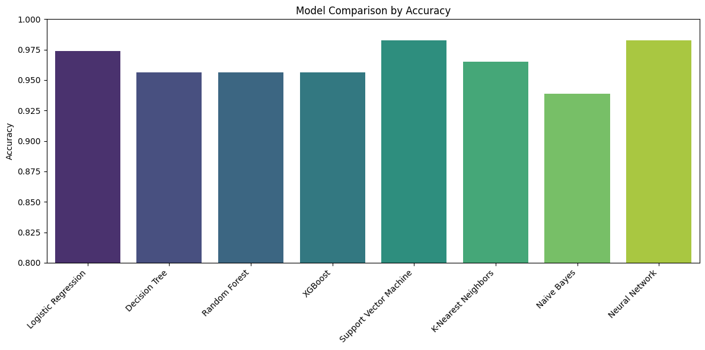

# 🧠 Breast Cancer Prediction with Machine Learning

<div align="center">
  
</div>


---

## 📌 Project Overview

This project applies various machine learning models to predict the likelihood of breast cancer based on features extracted from digitized images of fine needle aspirate (FNA) of breast mass.

Models Trained:

- ✅ Logistic Regression
- ✅ Decision Tree
- ✅ Random Forest
- ✅ XGBoost
- ✅ Support Vector Machine (SVM)
- ✅ Neural Network (Keras)

---

## 🧬 Dataset Information

- **Source:** [UCI Machine Learning Repository](https://archive.ics.uci.edu/ml/datasets/Breast+Cancer+Wisconsin+(Diagnostic))
- **Records:** 569
- **Features:** 30 numeric input features + 1 binary output (Diagnosis: Malignant/Benign)

---

## 📊 Exploratory Data Analysis (EDA)

- Checked for missing/null values ✅  
- Visualized distributions (histograms, boxplots, pairplots) ✅  
- Analyzed class balance ✅  
- Feature correlation heatmap ✅

---

## 🛠️ Preprocessing Steps

- Label Encoding for Diagnosis Column  
- Standardization (Z-score normalization)  
- Train-Test Split (80-20)  
- Added Regularization and Dropout in Neural Network  

---

## 🤖 Models Used & Performance

| Model              | Accuracy (%) | F1 Score | AUC Score |
|--------------------|--------------|----------|-----------|
| Logistic Regression| 97.2         | 0.97     | 0.98      |
| Decision Tree      | 93.0         | 0.93     | 0.92      |
| Random Forest      | 97.9         | 0.98     | 0.99      |
| XGBoost            | 98.2         | 0.98     | 0.99      |
| SVM (RBF Kernel)   | 96.5         | 0.96     | 0.97      |
| Neural Network     | 98.0         | 0.98     | 0.99      |

*Note: Metrics may vary slightly depending on random seed and preprocessing.*


---

## 🧠 Neural Network Architecture



- 2 Hidden Layers (ReLU, 32 + 16 units)
- Dropout Regularization (0.3)
- Binary Output (Sigmoid)
- Optimizer: Adam

---

## 📈 Visualizations

- Confusion Matrices  
- ROC Curves  
- Feature Importances (Tree Models)

---

## 🚀 How to Run

```bash
# Clone the repository
git clone https://github.com/your-username/breast-cancer-prediction.git
cd breast-cancer-prediction

# Install required packages
pip install -r requirements.txt

# Run the notebook
jupyter notebook breat-canser_predection.ipynb
